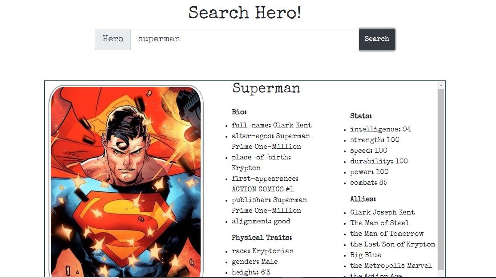
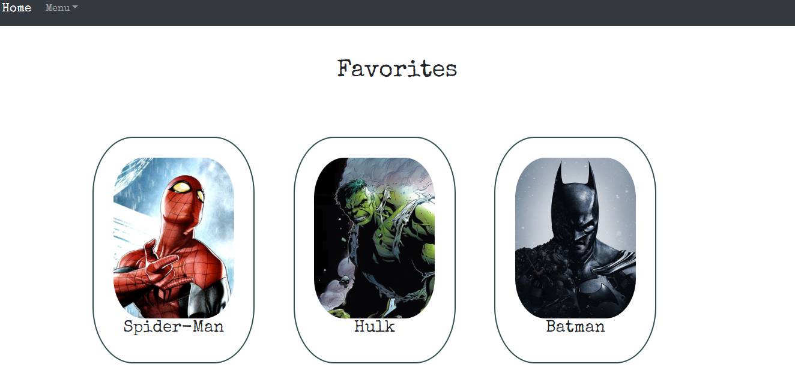
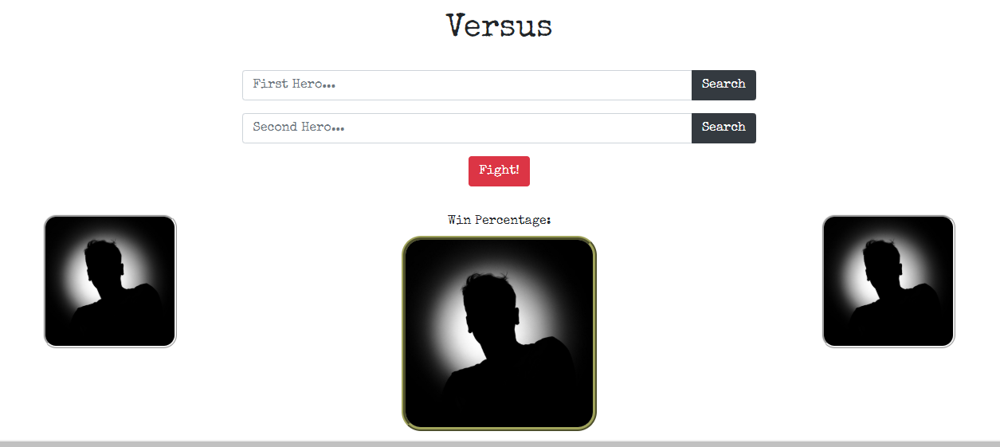
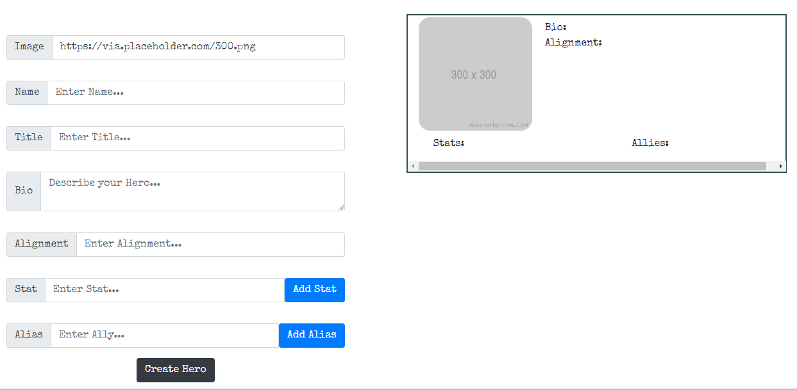
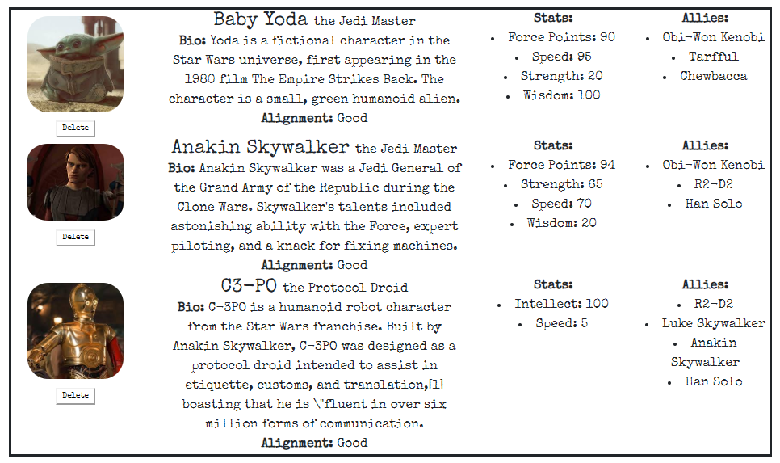

# Super Hero Finder

The Super Hero Finder is a website that utlizes an API called SuperHeroAPI. Filled with hundreds, and maybe thousands, of characters from all universes, comics, and movies. Each character has data such as biography information, physical traits, and other characters they are familiar with. Each character can be searched on the Search page. Two characters can fight on the Versus page to see who has higher combat statistics. This application also utilizes MongoDb. Each character can be favorited and added to the users Favorite Page, or you can create your own heroes which are currently Star Wars themed.

## Built With

* React
* Express
* MongoDB
* Node
* Bootstrap
* Heroku

## Pages
### Search Page

Search for any hero and see the informations retrieved from the API. When the user searches the input is sent to the API and an array of characters is returned. Array[0] is displayed on the page with all the information.

### Favorites Page

After clicking the Favorite button on the Search page, the character is stored in MongoDB. All characters stored in this databases can be viewed on this page.

### Versus Page

Search any two characters in the SuperHeroAPI and fight them. The winner is based on who has higher combat statistics which can be viewed on the Search page under each hero. The win percentage is calculated as: winner points / (winner + loser points).

### Create Page

Currently Star Wars themed, a user can create their own hero and give them statistics and make alliances. After submission the character is added to a MongoDB database.

### Creations Page

All heroes created on the Create page can be viewed here in a list. On page load the MongoDB is displayed on the page.