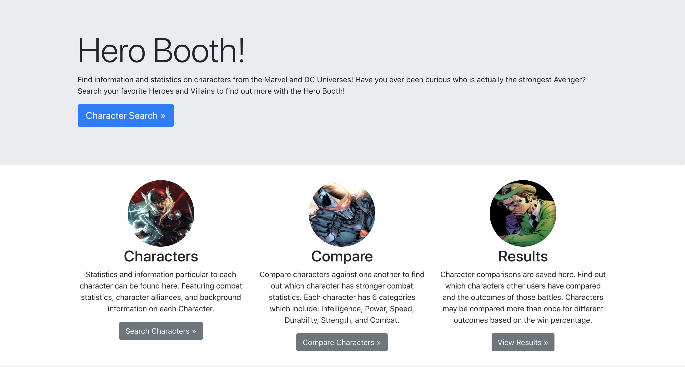
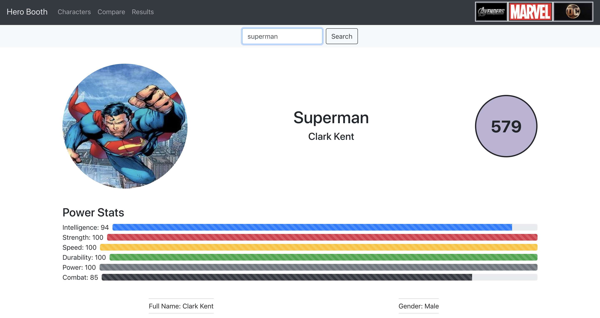
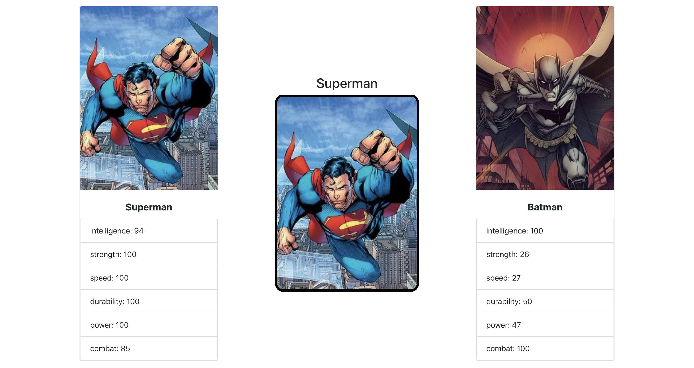
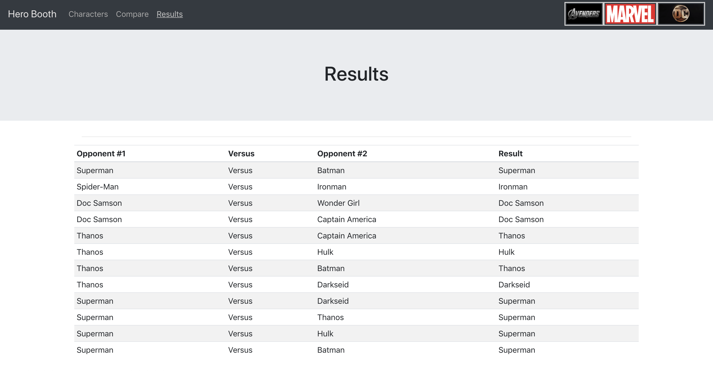

# Hero Booth

The Hero Booth is a website that utilizes Bootstrap components to create a unique polished user interface. This website uses an API caleed SuperHero API which is is filled with data for hundreds if not thousands of characters from all universes, comics, and movies. Each character can be searched, compared to other characters, and unique data to each can be found. This application utilizes MonogoDB to save results based on user comparisons. Find out what other people have searched for on the Results page.

## Built With

* React
* Express
* MongoDB
* Node
* Bootstrap
* Heroku
* FlexBox

## Pages

### Home Page

Home page displays an overview of the website and its contents. Made with a variety of BootStrap components to display a unique polished interface.

### Search Page

Search for any character and see the information retrieved from the API. When the user searches the input is sent to the API and an array of characters is returned. Array[0] is displayed on the page with all the information.

### Compare Page

Search any two characters in the SuperHeroAPI and fight them. The winner is based on who has higher combat statistics which can be viewed on the Search page under each hero.

### Results Page

All comparisons that have a result are saved to the mongo database and uploaded here. View your comparisons and find out what others have compared on this website.

https://herofinder.herokuapp.com/